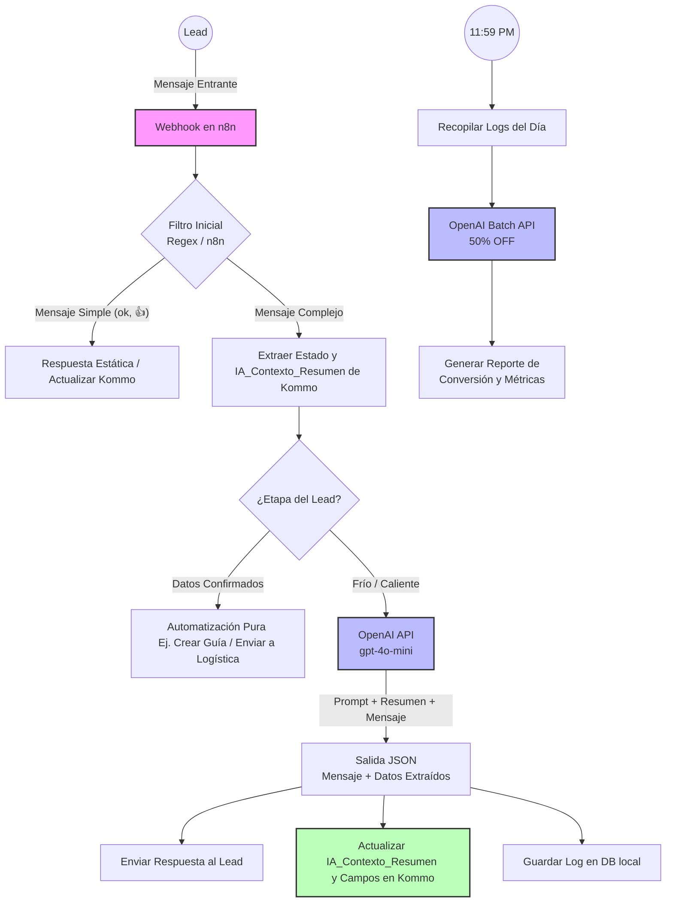

```mermaid
graph TD
    %% Entradas
    Lead((Lead)) -->|Mensaje Entrante| Webhook[Webhook en n8n]
    
    %% Capa 0: Aduana
    Webhook --> Triage{Filtro Inicial <br/>Regex / n8n}
    Triage -- "Mensaje Simple (ok, 👍)" --> Ignore[Respuesta Estática / Actualizar Kommo]
    
    %% Capa 1: Contexto
    Triage -- "Mensaje Complejo" --> GetContext[Extraer Estado y <br/>IA_Contexto_Resumen de Kommo]
    
    %% Capa 2: Evaluación de Estado
    GetContext --> CheckState{¿Etapa del Lead?}
    CheckState -- "Datos Confirmados" --> LogicOnly[Automatización Pura <br/>Ej. Crear Guía / Enviar a Logística]
    CheckState -- "Frío / Caliente" --> OpenAICall[OpenAI API <br/>gpt-4o-mini]
    
    %% Capa 3: Procesamiento IA
    OpenAICall --> |Prompt + Resumen + Mensaje| JSONResponse[Salida JSON <br/>Mensaje + Datos Extraídos]
    
    %% Capa 4: Acciones Simultáneas (n8n)
    JSONResponse --> SendMsg[Enviar Respuesta al Lead]
    JSONResponse --> UpdateKommo[Actualizar IA_Contexto_Resumen <br/>y Campos en Kommo]
    JSONResponse --> SaveLog[Guardar Log en DB local]
    
    %% Capa 5: Reporte Nocturno
    Cron((11:59 PM)) --> GatherLogs[Recopilar Logs del Día]
    GatherLogs --> BatchAPI[OpenAI Batch API <br/> 50% OFF]
    BatchAPI --> Report[Generar Reporte de <br/>Conversión y Métricas]
    
    %% Estilos (Opcional para renderizado)
    style Webhook fill:#f9f,stroke:#333,stroke-width:2px
    style OpenAICall fill:#bbf,stroke:#333,stroke-width:2px
    style BatchAPI fill:#bbf,stroke:#333,stroke-width:2px
    style UpdateKommo fill:#bfb,stroke:#333,stroke-width:2px
```
