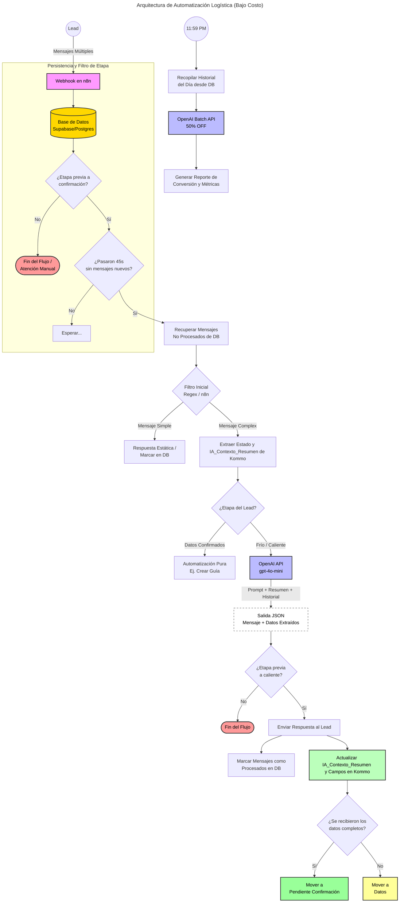

```mermaid
---
title: Arquitectura de Automatización Logística (Bajo Costo)
---
graph TD
    %% Entradas y Persistencia
    Lead((Lead)) -->|Mensajes Múltiples| Webhook[Webhook en n8n]
    
    subgraph Capa_Persistencia [Persistencia y Filtro de Etapa]
    Webhook --> SaveDB[(Base de Datos <br/>Supabase/Postgres)]
    SaveDB --> CheckPreConfirm{¿Etapa previa a <br/>confirmación?}
    
    CheckPreConfirm -- "No" --> EndFlow1([Fin del Flujo / <br/>Atención Manual])
    CheckPreConfirm -- "Sí" --> Debounce{¿Pasaron 45s <br/>sin mensajes nuevos?}
    
    Debounce -- "No" --> Wait[Esperar...]
    end

    %% Capa 0: Aduana y Contexto
    Debounce -- "Sí" --> GetHistory[Recuperar Mensajes <br/>No Procesados de DB]
    GetHistory --> Triage{Filtro Inicial <br/>Regex / n8n}
    
    Triage -- "Mensaje Simple" --> Ignore[Respuesta Estática / <br/>Marcar en DB]
    Triage -- "Mensaje Complex" --> GetContext[Extraer Estado y <br/>IA_Contexto_Resumen de Kommo]

    %% Capa 1: Evaluación de Operación
    GetContext --> CheckState{¿Etapa del Lead?}
    CheckState -- "Datos Confirmados" --> LogicOnly[Automatización Pura <br/>Ej. Crear Guía]
    CheckState -- "Frío / Caliente" --> OpenAICall[OpenAI API <br/>gpt-4o-mini]
    
    %% Capa 2: Procesamiento IA
    OpenAICall --> |Prompt + Resumen + Historial| JSONResponse[Salida JSON <br/>Mensaje + Datos Extraídos]
    
    JSONResponse --> CheckPreHot{¿Etapa previa <br/>a caliente?}
    CheckPreHot -- "No" --> EndFlow2([Fin del Flujo])
    CheckPreHot -- "Sí" --> SendMsg[Enviar Respuesta al Lead]
    
    %% Capa 3: Acciones Simultáneas (n8n)
    SendMsg --> MarkDone[Marcar Mensajes como <br/>Procesados en DB]
    SendMsg --> UpdateKommo[Actualizar IA_Contexto_Resumen <br/>y Campos en Kommo]

    UpdateKommo --> CheckComplete{¿Se recibieron los <br/>datos completos?}
    CheckComplete -- "Sí" --> MovePending[Mover a <br/>Pendiente Confirmación]
    CheckComplete -- "No" --> MoveData[Mover a <br/>Datos]

    %% Capa 4: Reporte Nocturno (Ahorro 50%)
    Cron((11:59 PM)) --> GatherLogs[Recopilar Historial <br/>del Día desde DB]
    GatherLogs --> BatchAPI[OpenAI Batch API <br/> 50% OFF]
    BatchAPI --> Report[Generar Reporte de <br/>Conversión y Métricas]

    %% ESTILOS PARA LEGIBILIDAD
    style Webhook fill:#f9f,stroke:#333,stroke-width:2px,color:#000
    style SaveDB fill:#ffd700,stroke:#333,stroke-width:2px,color:#000
    style OpenAICall fill:#bbf,stroke:#333,stroke-width:2px,color:#000
    style BatchAPI fill:#bbf,stroke:#333,stroke-width:2px,color:#000
    style UpdateKommo fill:#bfb,stroke:#333,stroke-width:2px,color:#000
    style JSONResponse fill:#fff,stroke:#333,stroke-dasharray: 5 5,color:#000
    style EndFlow1 fill:#ff9999,stroke:#333,stroke-width:2px,color:#000
    style EndFlow2 fill:#ff9999,stroke:#333,stroke-width:2px,color:#000
    style MovePending fill:#99ff99,stroke:#333,stroke-width:2px,color:#000
    style MoveData fill:#ffff99,stroke:#333,stroke-width:2px,color:#000
```
