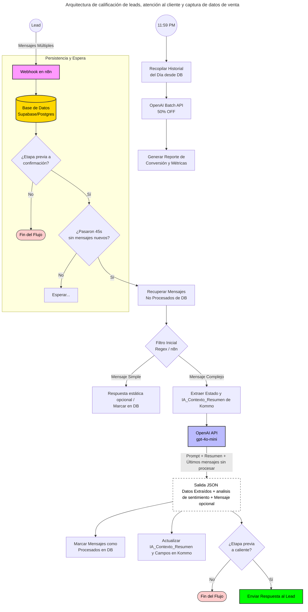

```mermaid
---
title: Arquitectura de calificación de leads, atención al cliente y captura de datos de venta
---
graph TD
    %% Entradas y Persistencia
    Lead((Lead)) -->|Mensajes Múltiples| Webhook[Webhook en n8n]
    
    subgraph Capa_Persistencia [Persistencia y Espera]
    Webhook --> SaveDB[(Base de Datos <br/>Supabase/Postgres)]
    SaveDB --> PreConfirm{¿Etapa previa a <br/>confirmación?}
    PreConfirm -- "No" --> End1([Fin del Flujo])
    PreConfirm -- "Sí" --> Debounce{¿Pasaron 45s <br/>sin mensajes nuevos?}
    Debounce -- "No" --> Wait[Esperar...]
    end

    %% Capa 0: Aduana y Contexto
    Debounce -- "Sí" --> GetHistory[Recuperar Mensajes <br/>No Procesados de DB]
    GetHistory --> Triage{Filtro Inicial <br/>Regex / n8n}
    
    Triage -- "Mensaje Simple" --> Ignore[Respuesta estática opcional / <br/>Marcar en DB]
    Triage -- "Mensaje Complejo" --> GetContext[Extraer Estado y <br/>IA_Contexto_Resumen de Kommo]

    %% Capa 1: Procesamiento IA Directo
    GetContext --> OpenAICall[OpenAI API <br/>gpt-4o-mini]
    
    %% Capa 2: Salida y Acciones Paralelas
    OpenAICall --> |Prompt + Resumen + Últimos mensajes sin procesar| JSONResponse[Salida JSON <br/>Datos Extraídos + analisis de sentimiento + Mensaje opcional]
    
    JSONResponse --> MarkDone[Marcar Mensajes como <br/>Procesados en DB]
    JSONResponse --> UpdateKommo[Actualizar IA_Contexto_Resumen <br/>y Campos en Kommo]
    JSONResponse --> CheckHot{¿Etapa previa <br/>a caliente?}

    %% Capa 3: Ramificación Final
    CheckHot -- "No" --> End2([Fin del Flujo])
    CheckHot -- "Sí" --> SendMsg[Enviar Respuesta al Lead]
    
    %% Capa 4: Reporte Nocturno
    Cron((11:59 PM)) --> GatherLogs[Recopilar Historial <br/>del Día desde DB]
    GatherLogs --> BatchAPI[OpenAI Batch API <br/> 50% OFF]
    BatchAPI --> Report[Generar Reporte de <br/>Conversión y Métricas]

    %% ESTILOS
    style Webhook fill:#f9f,stroke:#333,stroke-width:2px,color:#000
    style SaveDB fill:#ffd700,stroke:#333,stroke-width:2px,color:#000
    style OpenAICall fill:#bbf,stroke:#333,stroke-width:2px,color:#000
    style JSONResponse fill:#fff,stroke:#333,stroke-dasharray: 5 5,color:#000
    style SendMsg fill:#00ff00,stroke:#333,stroke-width:2px,color:#000
    style End1 fill:#ffcccc,stroke:#333,color:#000
    style End2 fill:#ffcccc,stroke:#333,color:#000
```
